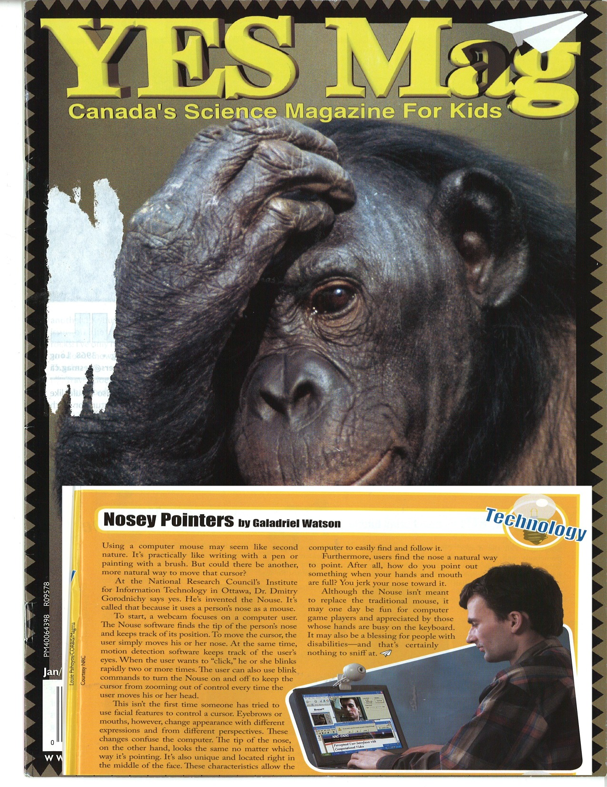

- ["Comme c'est beau!" ](https://www.linkedin.com/pulse/contribution-agencys-well-being-dmitry-gorodnichy%2F/) - contribution to the Agency's bulletin on well-being
- [Making use of Public Service Employee Survey (PSES) to improve Public Service culture: Data Science way](https://www.linkedin.com/pulse/analyzing-improving-public-service-performance-using-data-gorodnichy/)
  - WebApp Examples: https://itrack.shinyapps.io/PSES and https://itrack.shinyapps.io/PSES-CBSA-SE
  - Four recommendations to improve CBSA's lPSES ranking 
- [How to reduce Wait Time at the border at the border using historical data and Artificial Intelligence (#AI)](https://www.linkedin.com/pulse/predicting-optimizing-border-wait-time-using-dmitry-gorodnichy/) 
  - WebApp Example: https://itrack.shinyapps.io/border  
<!-- - Artificial Intelligence or Natural Ignorance? Some examples of both
-  What can happen to orgnization run When decision are made -->
- What #datascience and #AI can do to help dealing with #covid19 - coming 
<!-- - How to make electoral reform happen - to make Canada more democratic -->
- Data simulation: what will happen to Liberal party and Canada, if they don't change first pass the post electoral system - coming
 <!--  - What you can do to make it happen -->
<!--   - The problem with proportional representation-->
<!-- - Testing and deploying Biometrics:  good, bad and ugly
-  What happens when chemists test biometric technology 
- The hype and challenge of Face ecognition technology -->
  - [What one needs to know about variation of face recognition performance between demographics](https://www.linkedin.com/pulse/what-one-needs-know-variation-face-recognition-system-gorodnichy/)
<!-- - Doing Data Science: Computing Science way -->
- Why Space needs Canada, and Canadians too: 
  - Another outcome of a space program - an Intelligent Vision Interface tool to help paralyzed people: [www.nouse.ca](http://nouse.ca/news.php)
- From Natural Birth to Natural Life: 
  - Antroposophy (Waldorf education) from Rudolf Steiner vs. "How do you measure your life" from  Executives of Harward School of Business
- Natural death ?
  - Buddhist's experience: "Tibetan book of living and dying"
  - ["Two Lives"](https://bookdown.org/gorodnichy/twolives-book) book: How to bring it to English audience - 
<!--  - Personal feelings expressed in music: ["Shri Jobim"](https://bookdown.org/gorodnichy/jobim/) and ["Behind the horizon"](https://soundcloud.com/dmitry-gorodnichy/sets/adieu) -->

<!-- 
- The magic of falling a sleep
- On the magic of composing an original melody   
  - Why not a single original melody came to me lately -->
<!--  
- The beauty and power of diversity and multiculturalism 
  - Parallels:  Russian - Ukraine and US - Canada.
- How to better understand Zelenskly and what is happening now in Ukraine
- Why the war between Russia and Ukraine -->
<!--
- Your link to Ukrainian contemporaty music  one of the most melodic and harmonic in the world
 - How to bring the beauty and powers of other language works of literacture and music? -->
 

Feedback and thoughts - welcome!  
Send them to [my name]@[my surname].ca

Back to [www.gorodnichy.ca](www.gorodnichy.ca)
